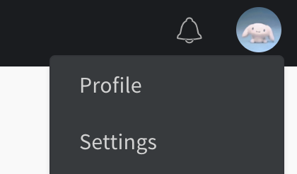
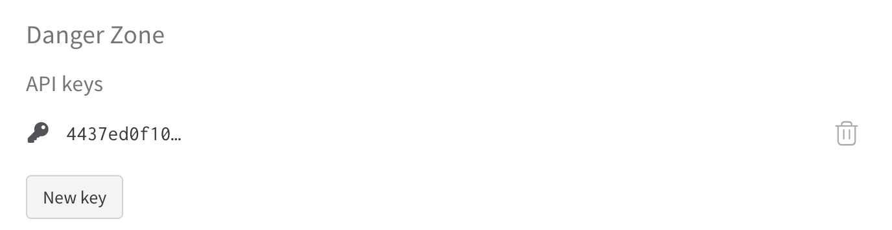

# APES: Attention-based Point Cloud Edge Sampling

<p>
<a href="https://arxiv.org/pdf/2302.14673.pdf">
    </a>
<a href="https://junweizheng93.github.io/publications/APES/APES.html">
    </a>
<a href="https://pytorch.org/">
    </a>
<a href="https://mmengine.readthedocs.io/en/latest/">
    </a>
<a href="https://github.com/JunweiZheng93/APES/blob/main/LICENSE">
    </a>
</p>

# Copyright
original article: Attention-Based Point Cloud Edge Sampling https://arxiv.org/pdf/2302.14673.pdf  

Author: Chengzhi Wu, Junwei Zheng, Julius Pfrommer, Jurgen Beyerer  

Code: The original code comes from Chengzhi Wu and Junwei Zheng, some minor modifications are made.   

Another public version(for test and application): https://github.com/JunweiZheng93/APES#apes-attention-based-point-cloud-edge-sampling
# Setup
Python version: 3.9
```bash
conda create -n pct python=3.9 -y
conda activate pct
```
To install all dependencies, enter:
```bash
pip install -r requirements.txt
```
Be careful, please install PyTorch using this command:
```bash
conda install pytorch==1.11.0 torchvision==0.12.0 cudatoolkit=11.3 -c pytorch -y
```
Install Pytorch3D:
```bash
conda install -c fvcore -c iopath -c conda-forge fvcore=0.1.5 iopath=0.1.9 -y
conda install -c pytorch3d pytorch3d=0.7.0 -y
```

# How to run

## Classification
When using `AnTao420M` dataset, run:  
train:
```bash
python train_modelnet.py datasets=modelnet_AnTao350M usr_config=YOUR/USR/CONFIG/PATH
```
test:
```bash
python test_modelnet.py datasets=modelnet_AnTao350M usr_config=YOUR/USR/CONFIG/PATH
```

## Segmentation
When using `AnTao350M` dataset, run:  
train:
```bash
python train_shapenet.py datasets=shapenet_AnTao350M usr_config=YOUR/USR/CONFIG/PATH
```
test:
```bash
python test_shapenet.py datasets=shapenet_AnTao350M usr_config=YOUR/USR/CONFIG/PATH
```

When using `Yi650M` dataset, run:  
train: 
```bash
python train_shapenet.py datasets=shapenet_Yi650M usr_config=YOUR/USR/CONFIG/PATH
```
test: 
```bash
python test_shapenet.py datasets=shapenet_Yi650M usr_config=YOUR/USR/CONFIG/PATH
```


# About configuration files
The train/test script will read the default configuration file (`./configs/default.yaml`) and the user specified 
configuration file before training/testing. It is not recommended to modify the default file directly. It is encouraged 
to create a new yaml file and specify the file via `usr_config` argument. For example, in your usr config file, enter:
```yaml
train:
  dataloader:
    batch_size: 32
  lr_scheduler:
    which: stepLR
    stepLR:
      gamma: 0.5
      decay_step: 50
```
Then run the train script:
```bash
python train_shapenet.py datasets=shapenet_AnTao350M usr_config=YOUR/USR/CONFIG/PATH
```
Check the default configuration file for all legal hyper-parameters.

## Examples of user configuration
classification: `./configs/usr_config_cls.yaml`  
segmentation: `./configs/usr_config_seg.yaml`

## Visualization
when you want to visualise the results, please set user config file:
```yaml
wandb:
  enable: true
test:
  visualize_preds:
    enable: true
  visualize_downsampled_points:
    enable: true
  visualize_attention_heatmap:
    enable: true
```
and run ```test_modelnet.py``` or ```test_shapenet.py```

# WandB (Weights and biases)
We use wandb to log all experiment results. It is an amazing logger for deep learning. If you want to disable the wandb 
logger, do it in your usr config:
```yaml
wandb:
  enable: false
```
Otherwise, you need to [create a wandb account](https://wandb.auth0.com/login?state=hKFo2SBjQURna1lEV1Jsb2dDUE5GYjZobGU4dUVmZEVRSzNGR6FupWxvZ2luo3RpZNkgU1pRX1JoM2RGQUw5WVRDZnNKeTJWYVV2b0xyX21HUDKjY2lk2SBWU001N1VDd1Q5d2JHU3hLdEVER1FISUtBQkhwcHpJdw&client=VSM57UCwT9wbGSxKtEDGQHIKABHppzIw&protocol=oauth2&nonce=cENYVVVPNC5MRWNmN3lGdw%3D%3D&redirect_uri=https%3A%2F%2Fapi.wandb.ai%2Foidc%2Fcallback&response_mode=form_post&response_type=id_token&scope=openid%20profile%20email&signup=true) first. 
Click the `Settings` and generate your API Key:


Then back to your usr config:
```yaml
wandb:
  enable: true
  api_key: your api key here  # your wandb api key
  entity: kit-ies  # the place to save your runs. can be your wandb username or team name
  project: pct  # the name of your project
  name: my_experiment  # the name of your run
```
Note: If you want to test or visualize the results, wandb.enable must be set to true during training and testing